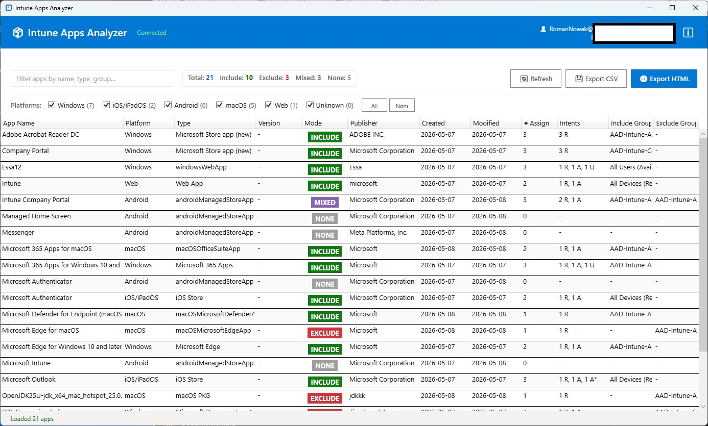

# 📦 Intune Apps Analyzer

**Intune Apps Analyzer** is a professional PowerShell-based GUI tool designed for Microsoft Intune administrators to analyze mobile application assignments through Microsoft Graph API.

The application provides a fast and intuitive way to inspect Include/Exclude group assignments and export detailed reports for auditing and troubleshooting purposes. Application has been prepared using **PowerShell**, **WPF** (Windows Presentation Foundation), **Microsoft Graph API** & **XAML**.

## ⚙️ Features

* **Assignment analysis** - Full visibility into deployment groups.
* **Identify applications without assignments** - Find orphaned apps quickly.
* **Get applications information** - Detailed data.
* **Export results** - Generate reports in **CSV** and **HTML** formats.
* **Authentication methods** - Support for both **Device Code** & **Interactive** (browser) login.

## 🔐 Security

* **Read-only** Microsoft Graph permissions.
* **No modification** of Intune configuration.
* **Safe** for production environments.

## 🔑 Requirements - Microsoft Graph Permissions

The following delegated permissions are required:

| Permission | Requirement |
| :--- | :--- |
| `DeviceManagementApps.Read.All` | To read application data and assignments. |
| `Group.Read.All` | To resolve group names and IDs. |

> [!IMPORTANT]
> Admin consent may be required depending on tenant configuration.

## 🎯 Example Use Cases

* **Intune environment auditing**
* **Assignment troubleshooting**
* **Security reviews**
* **Deployment verification**
* **Reporting and documentation**
* **Tenant cleanup operations**

---

