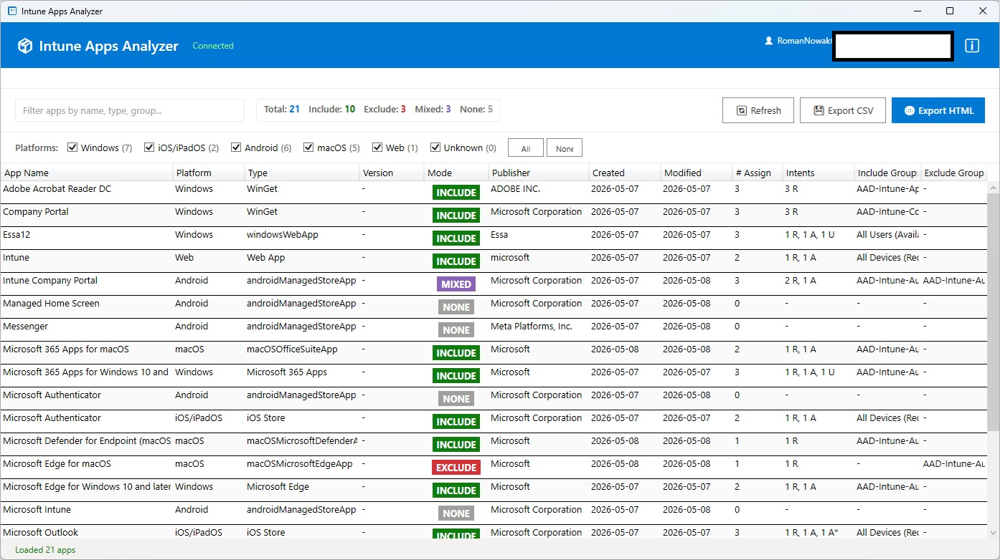

# Intune Apps Analyzer

Intune Apps Analyzer is a professional PowerShell-based GUI tool designed for Microsoft Intune administrators to analyze mobile application assignments through Microsoft Graph API.

The application provides a fast and intuitive way to inspect Include/Exclude group assignments and export detailed reports for auditing and troubleshooting purposes.

---

## Features

### Assignment Analysis
- Analyze all Microsoft Intune mobile applications
- View Include and Exclude group assignments
- Identify assigned filters
- Identify applications without assignments

### Application Information
- Display application name
- Publisher information
- Platform type
- Application version
- Assignment mode status

### Export Options
- Export results to CSV
- Export results to HTML
- Generate reporting-ready data

### User Interface
- Modern WPF graphical interface
- Sortable DataGrid
- Search and filtering support
- Responsive layout
- Two Microsoft Graph authentication methods (Interactive Login & Device Code Authentication)

### Security
- Read-only Microsoft Graph permissions
- No modification of Intune configuration
- Safe for production environments

---

## Screenshots

### Application Window

---

## Requirements

### Microsoft Graph Permissions
The following delegated permissions are required:

- `DeviceManagementApps.Read.All`
- `Group.Read.All`

Admin consent may be required depending on tenant configuration.

---
## Example Use Cases

- Intune environment auditing
- Assignment troubleshooting
- Security reviews
- Deployment verification
- Reporting and documentation
- Tenant cleanup operations

---

## Technologies Used

- PowerShell
- WPF (Windows Presentation Foundation)
- Microsoft Graph API
- XAML
